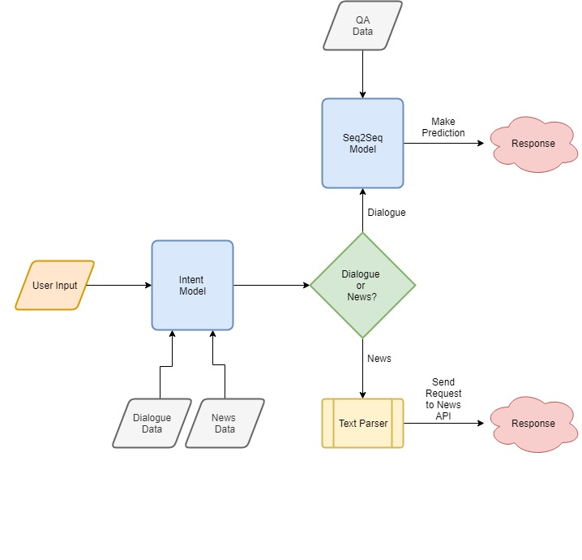
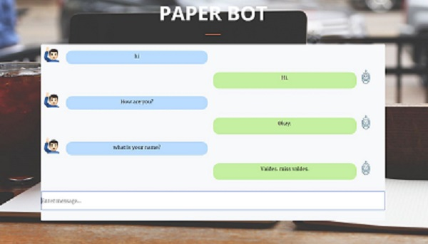

# Paper-Bot
A conversational chat bot &amp; news article recommender.

#### Table of Contents
* [Overview](#overview)
* [Project Details](#details)
* [Installation](#installation)
* [Running](#running)
* [Results](#results)

## Overview

This project builds an intent based chatbot capable of handling general conversations as well as providing news article recommendations. The conversational component is built using a seq2seq RNN model from [DeepQA](https://github.com/Conchylicultor/DeepQA). News articles recommendations are provided using the [NewsAPI](https://newsapi.org/). The diagram below shows in more detail the entire pipeline.



## Project Details

### Modeling

The system contains two modeling components: an intent model and a conversational model. The intent model is responsible for classifying the given user input as dialogue or news. It is built using logistic regression. Logistic regression was chosen mainly due to its ease of use in addition to its surprisingly high accuracy (>97%) for this task. 

The conversational model uses an encoder-decoder architecture built using two LSTMs (commonly referred to as a seq2seq model). The encoder endcodes the input into a "thought vector" while the decoder decodes the output vector into a response. You can read more about seq2seq models here: 

[Sequence to Sequence Learning with Neural Networks](https://arxiv.org/abs/1409.3215)

[Learning Phrase Representations using RNN Encoder-Decoder for Statistical Machine Translation](https://arxiv.org/abs/1406.1078)

### Datasets

The intent model is trained on two separate datasets: one representing general human dialogues and another representing possible queries a user may make when requesting news. The dialogue data can be found in `data/dialogue` and news data in `data/news/newsData.csv`. The newsData was generated manually, meaning I created the dataset by entering several queries that I thought someone would use when wanting to search for news articles. To enhance the size of the dataset, I left words unfilled in each of the queries which could be filled with possible keywords from categories coming from the NewsAPI. For example:

	Unfilled Query: Show me the latest news on <fill>.

	Then we can substitute <fill> with keywords such as business, sports or CNN which will give us a total of three queries:

	Show me the latest news on business.

	Show me the latest news on sports.

	Show me the latest news on CNN.

The unfilled queries can be found in  `data/news/newsSamples.json`.

The seq2seq model is trained using the [Cornell Movie Dialogs Corpus](http://www.cs.cornell.edu/~cristian/Cornell_Movie-Dialogs_Corpus.html). The data is sorted into question answer pairs before training and the code is found in `chatbot/corpus/cornelldata`.

### Text Features
Simple preprocessing steps were applied to both datasets for the intent model such as removing symbols and stopwords. The data when then vectorized using [tfidf](http://www.tfidf.com).

The seq2seq model uses arguments `--maxLength 10` and `--vocabularySize 40000` to limit the length of sentences and vocabulary size. The embeddings are initialized using pre-trained [GoogleNews](https://code.google.com/archive/p/word2vec) vectors with `--embeddingSize 64`.


### Text Parsing
To extract keywords from the user's input I use the `nltk` library. I utilized nltk's named entity recognizer to extract locations and part of speech tagger combined with chunking to extract possible search words. An issue using nltk's NER system was it had trouble recognizing locations that aren't properly capitalized so if a user typed `Show me news on the iphone in the united states` then `united states` wouldn't be recognized since it wasn't properly cased. To solve this I used [Truecaser](https://github.com/nreimers/truecaser) to convert the input to its most probable casing before applying NER.

### Installation
The program requires the following dependencies:

 * python 3.5
 * tensorflow
 * numpy
 * pandas
 * sklearn
 * CUDA
 * nltk
 * tqdm
 * flask
 * requests
 * iso3166

Run `pip3 install -r requirements.txt` to install requirements.


### Running
Before running the app we need to download some files:

For truecaser we need the pre-trained `distributions.obj` which contains the frequencies of unigrams, bigrams and trigrams which can be downloaded [here](https://github.com/nreimers/truecaser/releases) and placed in the `truecaser` directory.

The pre-trained seq2seq model can be downloaded [here](https://drive.google.com/file/d/1avtOqtgwCMbaY-z4nv0Tm5WddA94fGMK/view) and in the `save` directory make a directory called `model-server` and unzip the files into it.

To run the app:
```
cd app
python webapp.py
```
The app should then be running on [http://localhost:8080/](http://localhost:8080/).



### Results

Here's a sample dialog when running the app:

> **me:** Hi  
> **bot:** Hi.
> 
> **me:** How are you?  
> **bot:** Okay.
> 
> **me:** What's your name?  
> **bot:** Valdes. miss valdes.
> 
> **me:** show me the latest news in sports.  
> **bot:** 
> 
> Title: 
> Warriors takeaways: What we learned in 117-101 win over Grizzlies
> 
> Description: 
> Alfonzo McKinnie was exceptional once again, but the Warriors still had some issues Monday night against the Grizzlies.
> 
> URL: 
> https://www.nbcsports.com/bayarea/warriors/warriors-takeaways-what-we-learned-117-101-win-over-grizzlies
> 
> --------------------
> 
> Title: 
> Jimmy Butler turns away questions about LA future after loss to Clips
> 
> Description: 
> Jimmy Butler's present and potential future landing spot collided at Staples Center, where the Clippers beat Butler and the Timberwolves 120-109. But Butler wasn't interested in
> expounding on his potential future in L.A.
> 
> URL: 
> http://www.espn.com/nba/story/_/id/25191907/jimmy-butler-minnesota-timberwolves-turns-away-questions-future-los-angeles
> 
> --------------------
> 
> **me:** do you know where my cat went?  
> **bot:** I do n't know.
> 
>**me:** what news is there on the iphone?  
> **bot:** 
> 
> Title: 
> Apple's market cap fell below $1 trillion and its iPhone XR woes just clobbered stocks of its China suppliers too
> 
> Description: 
> Shares of Apple's suppliers across Asia were...
> 
> URL: 
> http://uk.businessinsider.com/apple-drops-below-1-trillion-clobbering-shares-of-china-suppliers-2018-11
> 
> --------------------
> 
> Title: 
> Apple's market cap fell below $1 trillion and its iPhone XR woes just clobbered stocks of its China suppliers too
> 
> Description: 
> Apple’s Asian suppliers fell after a report that Apple will halt additional production lines for the iPhone XR. The news sent Apple below $1 trillion.
> 
> URL: 
> https://www.businessinsider.com/apple-drops-below-1-trillion-clobbering-shares-of-china-suppliers-2018-11
> 
> --------------------
> 
