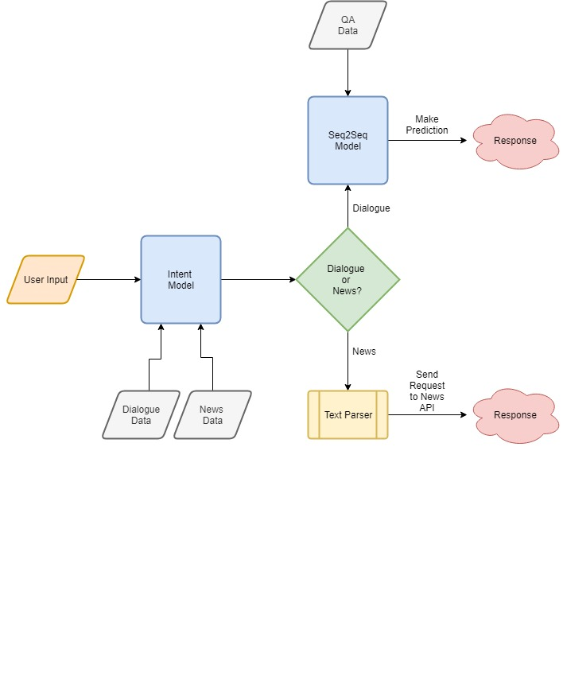

# Paper-Bot
A conversational chat bot &amp; news article recommender.

#### Table of Contents
* [Overview](#overview)
* [Project Details](#details)
* [Installation](#installation)
* [Running](#running)
* [Results](#results)

## Overview

This project builds an intent based chatbot capable of handling general conversations as well as providing news article recommendations. The conversational component is built using a seq2seq RNN model from [DeepQA](https://github.com/Conchylicultor/DeepQA). News articles recommendations are provided using the [NewsAPI](https://newsapi.org/). The diagram below shows in more detail the entire pipeline.

## Project Details

### Modeling

The system contains two modeling components: an intent model and a conversational model. The intent model is responsible for classifying the given user input as dialogue or news. It is built using logistic regression. Logistic regression was chosen mainly due to its ease of use in addition to its surprisingly high accuracy (>97%) for this task. 

The conversational model uses an encoder-decoder architecture built using two LSTMs (commonly referred to as a seq2seq model). The encoder endcodes the input into a "thought vector" while the decoder decodes the output vector into a response. You can read more about seq2seq models here: 

[Sequence to Sequence Learning with Neural Networks](https://arxiv.org/abs/1409.3215)
[Learning Phrase Representations using RNN Encoder-Decoder for Statistical Machine Translation](https://arxiv.org/abs/1406.1078)

### Datasets

The intent model is trained on two separate datasets: one representing general human dialogues and another representing possible queries a user may make when requesting news. The dialogue data can be found in `data/dialogue` and news data in `data/news/newsData.csv`. The newsData was generated manually, meaning I created the dataset by entering several queries that I thought someone would use when wanting to search for news articles. To enhance the size of the dataset I left words unfilled in each of the queries which could be filled with possible keywords from categories coming from the NewsAPI. For example:

Unfilled Query: `Show me the latest new on <fill>`

Then we can substitute `<fill>` with keywords such as `business` or `CNN` which will give us two queries.

`Show me the latest new on business`
`Show me the latest new on CNN`

The unfilled queries can be found in  `data/news/newsSamples.json`. 

### Text Features

### Text Parsing
After user input is received, the intent model classifies the input as dialogue or news.
